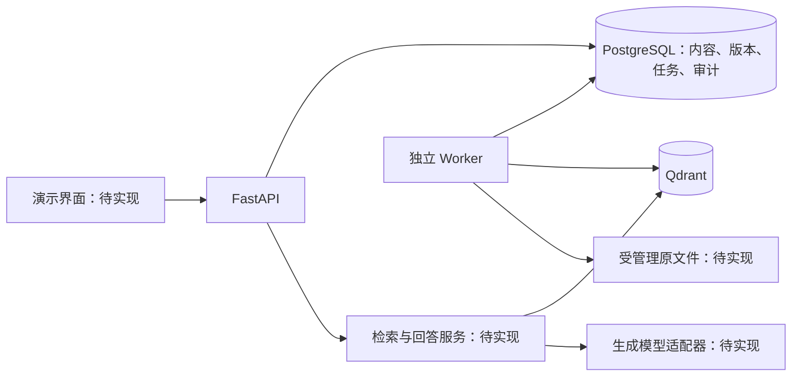

# RAG Portfolio 架构

本项目围绕可解释、可复现的文档问答展开。当前是 M1 工程基础，图中的导入、检索、生成和界面均为后续目标。

## 核心约定

1. PostgreSQL 保存文档版本、审核状态、完整发布清单和任务，是内容与可见性的权威来源；Qdrant 为可重建索引。
2. 导入、索引构建等工作通过持久任务执行，业务变更与任务登记在同一数据库事务内完成。
3. 后续发布采用先构建独立集合、再事务切换当前指针的方式。构建失败时保留原发布。
4. 检索身份来自服务端验证的 tenant/scope/audience；请求过滤只能缩小范围。召回后在数据库再次核验版本、权限和有效期。
5. 回答与检索分层。检索返回证据与来源，生成服务基于证据回答；缺少证据时给出明确结果，评测记录引用正确性。
6. 迁移 `0001` 保留继承模型；通用知识库分类、受众与场景字段整理通过后续 revision 演进。

## 现有实现边界

- API：健康检查、知识库注册/查询、探针任务提交/查询；检索接口只提供契约，返回 501。
- Worker：只执行 `system.probe`；长任务续租和导入/构建处理器待实现。
- 权限：固定 tenant 的服务令牌和读取 scope；真实用户身份和不同受众验证待实现。
- 模型：没有 embedding、reranker 或 LLM 运行时集成。
- 界面：Swagger 用于接口演示，文档上传与问答页面待实现。

## 适合面试解释的工程问题

| 问题 | 可展示的设计或后续实验 |
|---|---|
| 为什么需要关系库和向量库 | 内容版本与事务在关系库，召回索引在向量库 |
| 后台进程崩溃怎么办 | 数据库任务、过期租约重领、旧 token 无权完成任务 |
| 如何避免更新时半发布 | 新集合准备完成后切指针，冲突校验与回滚 |
| 为什么不能只信向量 payload | 撤销、时效和权限可能已变化，最终资格由关系库核验 |
| 如何证明 RAG 有收益 | 固定语料和问题集，对比 dense、hybrid、rerank，记录质量/延迟/成本 |

其中发布、检索和评测是设计目标，完成后补充实测记录。
